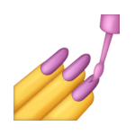
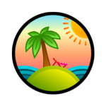

<!-- @format -->

To test the app, one might use the following credentials:

📧 Email: pjevic@icloud.com
🔐 Password: 123456789

New users can only sign up from within the app, which aligns with its core purpose. If a new user is signed up, the email must be confirmed to log in.

---

# The Wild Oasis

This project is a web application built as part of the Ultimate React Course by Jonas Schmedtmann. It is the most feature-complete version of the app covered in the course so far.

Throughout the course, I seized the opportunity to enhance its functionality by introducing a new feature – Add Booking. This feature allows users to seamlessly create bookings for cabins, enhancing the app’s usability and functionality.

## Technologies Used

This project utilizes the following technologies:

<div align="left">
<a href="https://vitejs.dev/"></a>
<a href="https://eslint.org/"></a>
<a href="https://react.dev/"></a>
<a href="https://styled-components.com/"></a>
<a href="https://reactrouter.com/"></a>
<a href="https://supabase.com/"></a>
<a href="https://tanstack.com/query/v4"></a>
<a href="https://tanstack.com/query/v4"></a>
<a href="https://react-icons.github.io/react-icons/"></a>
<a href="https://www.midjourney.com/"></a>
<a href="https://react-hook-form.com/"></a>
<a href="https://date-fns.org/"></a>
<a href="https://recharts.org/en-US/"></a>
</div>

---

## How to Check My Own Commit Improvements

To compare two commits and see the changes in terms of insertions and deletions, you can use the following command:

```bash
git diff 0fa6999..5c03ee1
```

## Acknowledgements

Special thanks to Jonas Schmedtmann for creating the Ultimate React Course and inspiring this project.
Thanks to the community for their valuable feedback and support.
