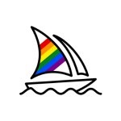

<!-- @format -->

# The Wild Oasis

## Technologies Used

Here are the main tools and frameworks employed in this project:

## Why React Query?

- Powerful library for managing remote (server) state
- Many fetures that allow us to write a lot less code, while also making the UX a lot better
  - Data is stored in a cache
  - Automatic loading and error states
  - Automatic re-fetching to keep state synched
  - Pre-fetching (pagination)
  - Easy remote state mutation (updatin)
  - Offline support
- Needed because remote state is fundamentally diffrent from regular (UI) state
